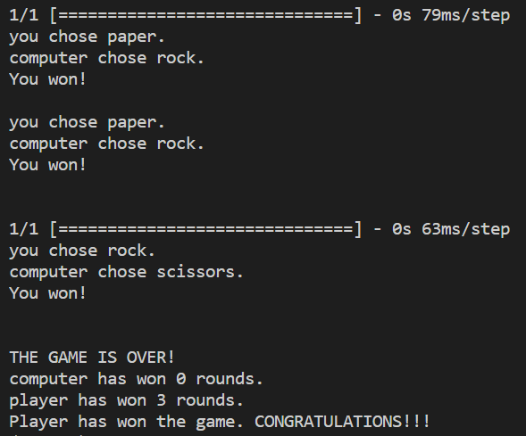

# Rock, Paper, Scissors Game with Computer Vision

## Description
This project is a rock, paper and scissors game using computer vision. The player of the project can use the webcam of their device to signal either rock, paper or scissors and play the game with the computer. The project is separated in milestones; wherein in each milestone, some basic funcionality or task is achieved. There are 3 milestones for this project. Namely, [Milestone 2](#milestone-2), [Milestone 4](#milestone-4) and [Milestone 5](#milestone-5). Finally, two versions of the game is developed, `text version` and `computer vision version`. The text version of the game is implemented in `manual_rps.py` and the computer vision version is implemented in `camera_rps.py`.

## Table of Contents
1. [Getting started](#getting-started)
    - [Cloning the project](#cloning-the-project)
    - [Environment setup](#environment-setup)
    - [Requirements](#requirements)
2. [Running the game](#running-the-game)
    - [Running text version](#running-text-version)
    - [Running computer vision version](#running-computer-vision-version)
4. [Milestone 2](#milestone-2)
5. [Milestone 4](#milestone-4)
    - [Function 1](#function-1)
    - [Function 2](#function-2)
    - [Function 3](#function-3)
    - [Function 4](#function-4)
6. [Milestone 5](#milestone-5)
    - [Function 1](#function-1)
    - [Function 2](#function-2)
    - [Function 3](#function-3)
    - [Function 4](#function-4)
    - [Function 5](#function-5)

## Getting started
### Cloning the project
The project can be cloned with the following command:
```bash
git clone https://github.com/prg48/computer-vision-rock-paper-scissors.git
```

Navigate to the cloned project directory:
```bash
cd computer-vision-rock-paper-scissors
```

### Environment setup
After cloning the project, it is better to setup an environment with either `conda` or `virtualenv` to run the project. For installation of conda, you can follow the [official conda installation guide](https://docs.conda.io/projects/conda/en/latest/user-guide/install/index.html). For installation of virtualenv, you can follow the [virtualenv installation guide](https://virtualenv.pypa.io/en/latest/installation.html).

To setup an environment with conda, you can enter the following commmand:
```bash
conda create --name my_env python
```
Please replace `my_env` with the your preferred environment name. 
To activate the environment, use the command:
```bash
conda activate my_env
```
Please replace `my_env` with the environment name you named while creating the environment.

If you are using virtualenv to create an environment, you can follow the instruction [here](https://docs.python.org/3/library/venv.html).

Also install pip after activating the environment to install requirements:
```bash
conda install pip
```

### Requirements
The requirements for the project can be found in `requirements.txt`. Run the following command to install requirements:
```bash
pip install -r requirements.txt
```

## Running the game
### Running text version
There are 2 versions of the game; `text version` and `computer vision version`, developed for milestone 4 and milestone 5 respectively. To run the text version of the game, run the following command:
```bash
python manual_rps.py
```

The game starts in the terminal. The player can press either `Ctrl + c` or `q` to exit the game. The game can be played by entering either `rock, paper or scissors`.

<div align="center">
  
  <p>Game start</p>
</div>

<div align="center">
  
  <p>Game play</p>
</div>

<div align="center">
  
  <p>Game exit</p>
</div>

### Running computer vision version
To run the computer vision version of the game, run the following command:
```bash
python camera_rps.py
```

The computer vision version uses the webcam. The player can signal either rock, paper or scissors with their hand and the computer will classify it. When either the computer or the player wins the game for three rounds, the game ends. The game can also be exited by pressing `q`.

<div align="center">
    
    <p>Game play</p>
</div>

## Milestone 2
For milestone 2 of the project, an image recognition model was trained in [teacheable machine app](https://teachablemachine.withgoogle.com/) which allows users to train an image recognition model on the browser. Four classes were labeled namely rock, paper, scissors and nothing. The image samples for all classes were fairly uniform. The sample sizes for each class and hyperparameters for the training of the model were as follows:
* sample_nothing: 124
* sample_rock: 136
* sample_paper: 152
* sample_scissors: 170
* epoch: 150
* batch size: 16
* learning rate: 0.001

The trained model was downloaded on a tensorflow keras format and was named `keras_model.h5` and the labels for the model was downloaded on a text format and named `labels.txt`. The model will be used for prediction in the upcoming milestones for the rock, paper and scissor game. One way the model can be used for the game project is by using the OpenCV keras API. The game will involve the player with the webcam on and the computer. The computer will choose either rock, paper or scissor and the player will use the webcam to gesture the same. The game will use OpenCV API and the trained model to label the gesture of the player through the webcam and classify it as either rock, paper, scissor or nothing. Then, the game can decide who has won the game.

## Milestone 4
The environment for the project is setup using conda command `conda create --name my_env python`. This created an environment named `my_env` with default `python` and `pip` installed. Then, three more packages; `opencv-python`, `tensorflow` and `ipykernel` were installed using the pip command, `pip install opencv-python tensorflow ipykernel`. All the dependencies of the project are redirected to the file, `requirements.txt` using the command, `pip list > requirements.txt`. This makes it easier for any other user who wants to re-create the project install the exact dependencies. 

The code for this milestone uses the `random` module and can be found in the file `manual_rps.py`. The code is divided into four functions:
### Function 1
```python
def get_computer_choice():
    choices = ["rock", "paper", "scissors"]
    return random.choice(choices)
```
The `get_computer_choice` function simulates a choice from the computer. It chooses a random choice from a list of choices, `rock, paper or scissors` and returns it.

### Function 2
```python
def get_user_choice():
    valid_choices = ["rock", "paper", "scissors", "q"]
    choice = input("Please pick between rock, paper or scissors: ")
    if choice.lower() in valid_choices:
        return choice.lower()
    else:
        raise ValueError("Please enter a valid input.")
```
The `get_user_choice` function simulates a choice from the user. It asks the user to input a choice from choices, `rock, paper , scissors or q` and return it. Furthermore, the function validates the user's choice and raises `ValueError` if the choice is not valid.

### Function 3
```python
def get_winner(computer_choice, user_choice):
    computer_wins = "You lost"
    player_wins = "You won!"
    tie = "It is a tie!"
    if computer_choice == "rock" and user_choice.lower() == "rock":
        print(tie)
    elif computer_choice == "rock" and user_choice.lower() == "paper":
        print(player_wins)
    elif computer_choice == "rock" and user_choice.lower() == "scissors":
        print(computer_wins)
    elif computer_choice == "paper" and user_choice.lower() == "rock":
        print(computer_wins)
    elif computer_choice == "paper" and user_choice.lower() == "paper":
        print(tie)
    elif computer_choice == "paper" and user_choice.lower() == "scissors":
        print(player_wins)
    elif computer_choice == "scissors" and user_choice.lower() == "rock":
        print(player_wins)
    elif computer_choice == "scissors" and user_choice.lower() == "paper":
        print(computer_wins)
    elif computer_choice == "scissors" and user_choice.lower() == "scissors":
        print(tie)
```
The `get_winner` function abstracts the logic for the winner and prints the statement for the winner, loser or if the game is a tie. It takes two arguments, namely, `computer_choice` and `user_choice`. Then, it decides either the player or the computer won or if the game is a tie.

### Function 4
```python
def play():
    game_finish_str = "Thank you for playing rock, paper and scissors game.\nPlease visit again."

    print("Welcome to rock, paper and scissors game........................")
    print("To quit, press 'Ctrl + c'")
    print("OR")
    print("Enter 'q' and press return when asked to choose between rock, paper or scissors.......\n")
    while True:
        computer_choice = get_computer_choice()

        try:
            user_choice = get_user_choice()

            ## if user has entered 'q', quit the game
            if user_choice == 'q':
                print(game_finish_str)
                break
            print(f"You chose {user_choice}")
            print(f"Computer chose {computer_choice}")
            get_winner(computer_choice, user_choice)
            print()

        except ValueError:
            print("Please enter a valid input.\n")

        except KeyboardInterrupt:
            print("\n" + game_finish_str)
            break
```
The `play` function runs the game unless the player either presses `q` or enters `Ctrl + c`. It also deals with `ValueError` which is raised by the `user_choice` function and the `KeyboardInterrupt` error raised when the player presses `Ctrl + c`.

## Milestone 5
For Milesone 5, computer vision version of the game is developed. The code for this version imports the following library:
* cv2
* load_model from keras.model
* numpy
* time
* random

The code for the milestone is divided into five functions. 
### Function 1
```python
def get_prediction(image, model):
    prediction = model.predict(image)

    # get index of the highest probability
    max_idx = np.argmax(prediction[0])

    if max_idx == 0:
        return "nothing"
    elif max_idx == 1:
        return "rock"
    elif max_idx == 2:
        return "paper"
    elif max_idx == 3:
        return "scissors"
```
The `get_prediction` function predicts the class of the image into either `rock, paper, scissors or nothing` using the model provided.

### Function 2
```python
def get_computer_choice():
    choices = ["rock", "paper", "scissors"]
    return random.choice(choices)
```
The `get_computer_choice` function simulates a choice from the computer. It chooses a random choice from a list of choices, `rock, paper or scissors` and returns it.

### Function 3
```python
def get_winner(computer_choice, user_choice):
    computer_wins = "You lost"
    player_wins = "You won!"
    tie = "It is a tie!"
    if computer_choice == "rock" and user_choice.lower() == "rock":
        return tie
    elif computer_choice == "rock" and user_choice.lower() == "paper":
        return player_wins
    elif computer_choice == "rock" and user_choice.lower() == "scissors":
        return computer_wins
    elif computer_choice == "paper" and user_choice.lower() == "rock":
        return computer_wins
    elif computer_choice == "paper" and user_choice.lower() == "paper":
        return tie
    elif computer_choice == "paper" and user_choice.lower() == "scissors":
        return player_wins
    elif computer_choice == "scissors" and user_choice.lower() == "rock":
        return player_wins
    elif computer_choice == "scissors" and user_choice.lower() == "paper":
        return computer_wins
    elif computer_choice == "scissors" and user_choice.lower() == "scissors":
        return tie
    elif computer_choice == "rock" and user_choice.lower() == "nothing":
        return tie
    elif computer_choice == "paper" and user_choice.lower() == "nothing":
        return tie
    elif computer_choice == "scissors" and user_choice.lower() == "nothing":
        return tie
```
The `get_winner` function abstracts the logic for the winner and returns the correct statement for the winner, loser or if the game is a tie. It takes two arguments, namely, `computer_choice` and `user_choice`. Then, it decides either the player or the computer won or if the game is a tie.

### Function 4
```python
def print_final_results(computer_wins, user_wins):
    final_score = f"computer has won {computer_wins} rounds.\nplayer has won {user_wins} rounds."
    print("THE GAME IS OVER!")
    if computer_wins == 3:
        print(final_score)
        print("Computer has won the game.")

    elif user_wins == 3:
        print(final_score)
        print("Player has won the game. CONGRATULATIONS!!!")
```
The `print_final_results` function print the final results of the game. It takes `computer_wins` and `user_wins`, decides who won the game and prints the correct win results. Whoever wins 3 rounds of the game wins the game.

### Function 5
```python
def play():
    # load the model
    model = load_model("keras_model.h5")

    # start the webcam
    cap = cv2.VideoCapture(0)

    # setup initial wins for computer and user
    computer_wins = 0
    user_wins = 0

    # set start time
    start_time = time.time()

    while True:
        # read the frame
        ret, frame = cap.read()
        # show the frame in a window
        cv2.imshow('frame', frame)

        # set the end time
        end_time = time.time()
        # calculate how many seconds have passed
        elapsed_time = end_time - start_time

        # if 3 seconds have passed 
        if elapsed_time > 3:
            # reset the start time
            start_time = end_time

            # prepare the image
            data = np.ndarray(shape=(1,224,224,3), dtype=np.float32)
            resized_frame = cv2.resize(frame, (224,224), interpolation=cv2.INTER_AREA)
            image_np = np.array(resized_frame)
            normalized_image = (image_np.astype(np.float32) / 127.0) - 1 
            data[0] = normalized_image

            # get user choice as prediction from model
            prediction = get_prediction(data, model)
            print(f"you chose {prediction}.")

            # get computer choice
            computer_choice = get_computer_choice()
            print(f"computer chose {computer_choice}.")

            # print the winner
            winner = get_winner(computer_choice, prediction)
            print(winner)
            print('\n')

            # track computer and user wins
            if winner.lower() == "you lost":
                computer_wins += 1
            elif winner.lower() == "you won!":
                user_wins += 1

            # if either user or computer has won 3 times, the game is over!
            if computer_wins == 3 or user_wins == 3:
                print_final_results(computer_wins, user_wins)
                break

        # if key q is pressed quit
        if cv2.waitKey(1) & 0xFF == ord('q'):
            break

    cap.release()
    cv2.destroyAllWindows()
```
The `play` function simulates the game. It runs a couple of important tasks. 
* It loads the model and camera.
* It keeps track of the player and computer wins.
* It keeps track of the timer. Each round is 3 seconds.
* It decides if the game has ended.
* It takes care of closing the camera.