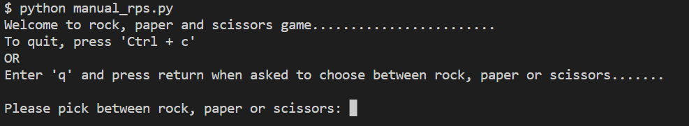
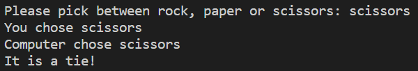
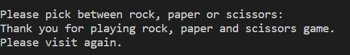

# Rock, Paper, Scissors Game with Computer Vision

## Description
This project is a rock, paper and scissors game using computer vision. The player of the project can use the webcam of their device to signal either rock, paper or scissors and play the game with the computer. The project is separated in milestones; wherein in each milestone, some basic funcionality or task is achieved. There are 3 milestones for this project. Namely, [Milestone 2](#milestone-2), [Milestone 4](#milestone-4) and [Milestone 5](#milestone-5). Finally, two versions of the game is developed, `text version` and `computer vision version`. The text version of the game is implemented in `manual_rps.py` and the computer vision version is implemented in `camera_rps.py`.

## Table of Contents
1. [Getting started](#getting-started)
2. [Running the game](#running-the-game)
4. [Milestone 2](#milestone-2)
5. [Milestone 4](#milestone-4)
6. [Milestone 5](#milestone-5)

## Getting started
### Cloning the project
The project can be cloned with the following command:
```bash
git clone https://github.com/prg48/computer-vision-rock-paper-scissors.git
```

Navigate to the cloned project directory:
```bash
cd computer-vision-rock-paper-scissors
```

### Environment setup
After cloning the project, it is better to setup an environment with either `conda` or `virtualenv` to run the project. For installation of conda, you can follow the [official conda installation guide](https://docs.conda.io/projects/conda/en/latest/user-guide/install/index.html). For installation of virtualenv, you can follow the [virtualenv installation guide](https://virtualenv.pypa.io/en/latest/installation.html).

To setup an environment with conda, you can enter the following commmand:
```bash
conda create --name my_env python
```
Please replace `my_env` with the your preferred environment name. 
To activate the environment, use the command:
```bash
conda activate my_env
```
Please replace `my_env` with the environment name you named while creating the environment.

If you are using virtualenv to create an environment, you can follow the instruction [here](https://docs.python.org/3/library/venv.html).

Also install pip after activating the environment to install requirements:
```bash
conda install pip
```

### Requirements
The requirements for the project can be found in `requirements.txt`. Run the following command to install requirements:
```bash
pip install -r requirements.txt
```

## Running the game
### Running text version
There are 2 versions of the game; `text version` and `computer vision version`, developed for milestone 4 and milestone 5 respectively. To run the text version of the game, run the following command:
```bash
python manual_rps.py
```

The game starts in the terminal. The player can press either `Ctrl + c` or `q` to exit the game. The game can be played by entering either `rock, paper or scissors`.

<figure>
    
    <figcaption>Game start</figcaption>
</figure>

<figure>
    
    <figcaption>Game play</figcaption>
</figure>

<figure>
    
    <figcaption>Game exit</figcaption>
</figure>

### Running computer vision version
To run the computer vision version of the game, run the following command:
```bash
python camera_rps.py
```

## Milestone 2
For milestone 2 of the project, an image recognition model was trained in [teacheable machine app](https://teachablemachine.withgoogle.com/) which allows users to train an image recognition model on the browser. Four classes were labeled namely rock, paper, scissors and nothing. The image samples for all classes were uniform, i.e. 46 images so that there is balance of sample images for each class. The hyperparameters for the training of the model were as follows:
* epoch: 80
* batch size: 16
* learning rate: 0.001

The trained model was downloaded on a tensorflow keras format and was named `keras_model.h5` and the labels for the model was downloaded on a text format and named `labels.txt`. The model will be used for prediction in the upcoming milestones for the rock, paper and scissor game. One way the model can be used for the game project is by using the OpenCV keras API. The game will involve the player with the webcam on and the computer. The computer will choose either rock, paper or scissor and the player will use the webcam to gesture the same. The game will use OpenCV API and the trained model to label the gesture of the player through the webcam and classify it as either rock, paper, scissor or nothing. Then, the game can decide who has won the game.

## Milestone 4
The environment for the project is setup using conda command `conda create --name my_env python`. This created an environment named `my_env` with default `python` and `pip` installed. Then, three more packages; `opencv-python`, `tensorflow` and `ipykernel` were installed using the pip command, `pip install opencv-python tensorflow ipykernel`. All the dependencies of the project are redirected to the file, `requirements.txt` using the command, `pip list > requirements.txt`. This makes it easier for any other user who wants to re-create the project install the exact dependencies. 

The code for this milestone uses the `random` module and can be found in the file `manual_rps.py`. The code is divided into four functions:
### Function 1
```python
def get_computer_choice():
    choices = ["rock", "paper", "scissors"]
    return random.choice(choices)
```
The `get_computer_choice` function simulates a choice from the computer. It chooses a random choice from a list of choices, `rock, paper or scissors` and returns it.

### Function 2
```python
def get_user_choice():
    choice = input("Please pick between rock, paper and scissors: ")
    return choice
```
The `get_user_choice` function simulates a choice from the user. It asks the user to input a choice from choices, `rock, paper or scissors` and return it. Furthermore, user validation can be added to this function. However, it has not been added for this milestone.

### Function 3
```python
def get_winner(computer_choice, user_choice):
    computer_wins = "You lost"
    player_wins = "You won!"
    tie = "It is a tie!"
    if computer_choice == "rock" and user_choice.lower() == "rock":
        print(tie)
    elif computer_choice == "rock" and user_choice.lower() == "paper":
        print(player_wins)
    elif computer_choice == "rock" and user_choice.lower() == "scissors":
        print(computer_wins)
    elif computer_choice == "paper" and user_choice.lower() == "rock":
        print(computer_wins)
    elif computer_choice == "paper" and user_choice.lower() == "paper":
        print(tie)
    elif computer_choice == "paper" and user_choice.lower() == "scissors":
        print(player_wins)
    elif computer_choice == "scissors" and user_choice.lower() == "rock":
        print(player_wins)
    elif computer_choice == "scissors" and user_choice.lower() == "paper":
        print(computer_wins)
    elif computer_choice == "scissors" and user_choice.lower() == "scissors":
        print(tie)
```
The `get_winner` function abstracts the logic for the winner and prints the statement for the winner, loser or if the game is a tie. It takes two arguments, namely, `computer_choice` and `user_choice`. Then, it decides either the player or the computer won or if the game is a tie.

### Function 4
```python
def play():
    computer_choice = get_computer_choice()
    user_choice = get_user_choice()
    return get_winner(computer_choice, user_choice)
```
The `play` function simulates one game of the rock, paper and scissors game. It brings together all the previous functions to simulate a game. It get a `computer_choice` using the `get_computer_choice` function. Then, it gets the `user_choice` with the `get_user_choice` function. Finally, it decides on the winner using the `get_winner` function and returns it.

## Milestone 5